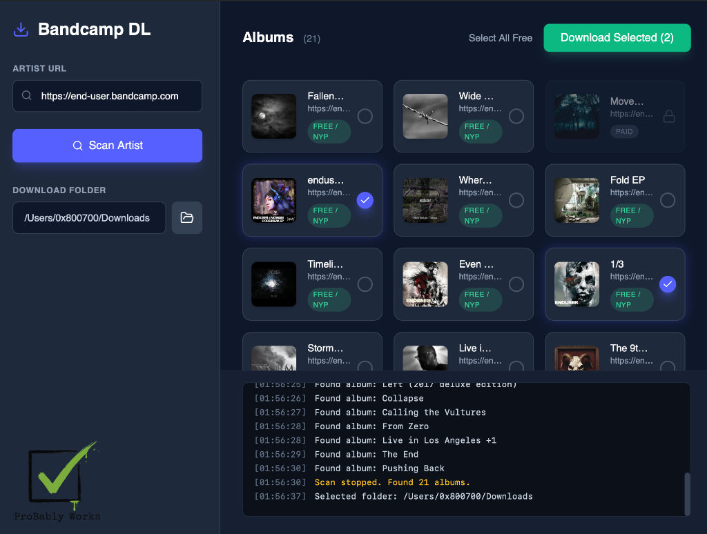
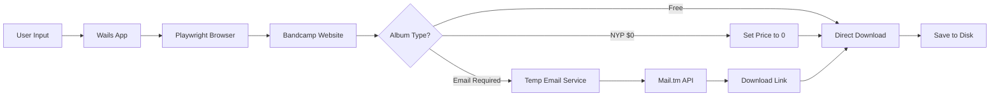

# 🎵 Bandcamp Downloader

A modern desktop application for downloading music from Bandcamp with support for free albums, "Name Your Price" releases, and automated email verification.



## ✨ Features

- 🔍 **Smart Artist Scanning** - Automatically discover all albums from any Bandcamp artist
- 💰 **Multi-tier Support** - Download free albums, "Name Your Price" releases, and handle paid content detection
- 📧 **Automated Email Flow** - Temporary email generation for albums requiring email verification
- 🎨 **Modern UI** - Beautiful dark-themed interface built with React and Tailwind CSS
- ⚡ **Real-time Updates** - Live progress tracking during scanning and downloading
- 🎯 **Batch Downloads** - Select and download multiple albums simultaneously
- 🎼 **Format Selection** - Choose between FLAC, MP3-320, and other available formats

## 🚀 Quick Start

### Download Pre-built Application (Recommended)

**For macOS users:**
1. Go to [Releases](https://github.com/0x800700/bcdl-go/releases)
2. Download the latest `Bandcamp.Downloader.macOS.zip`
3. Extract and run `Bandcamp Downloader.app`
4. No additional dependencies required!

> ⚠️ **Note**: Currently only macOS builds are officially tested and supported.

## 🏗️ Architecture

### Technology Stack

**Frontend:**
- React 18 + TypeScript
- Tailwind CSS for styling
- Vite for build tooling
- Framer Motion for animations

**Backend:**
- Go 1.23
- Wails v2 (Go + Web GUI framework)
- Playwright-Go for browser automation
- Mail.tm API for temporary email generation

### How It Works



### Key Components

1. **Scanner Service** (`backend/services/scanner.go`)
   - Navigates to artist pages
   - Extracts album metadata (title, cover, price, status)
   - Emits real-time events to frontend

2. **Downloader Service** (`backend/services/downloader.go`)
   - Handles multiple download flows (free, NYP, email-required)
   - Manages cookie banners and page interactions
   - Supports format selection

3. **Temp Email Service** (`backend/services/temp_email.go`)
   - Generates temporary email addresses via Mail.tm
   - Polls inbox for Bandcamp download links
   - Extracts and validates download URLs

## 🛠️ Building from Source

> ⚠️ **Important**: Building from source requires installing development tools (~3 GB). For most users, we recommend downloading the pre-built application from [Releases](https://github.com/0x800700/bcdl-go/releases).

### Prerequisites (macOS only)

1. **Xcode Command Line Tools** (~1.5 GB)
   ```bash
   xcode-select --install
   ```

2. **Go 1.23+** (~150 MB)
   ```bash
   # Download from https://golang.org/dl/
   # Or via Homebrew:
   brew install go
   ```

3. **Node.js 20+** (~50 MB)
   ```bash
   # Download from https://nodejs.org/
   # Or via Homebrew:
   brew install node
   ```

4. **Wails CLI** (~30 MB)
   ```bash
   go install github.com/wailsapp/wails/v2/cmd/wails@latest
   ```

### Build Steps

```bash
# Clone the repository
git clone https://github.com/0x800700/bcdl-go.git
cd bcdl-go

# Install Go dependencies
go mod download

# Build the application
~/go/bin/wails build -platform darwin/universal -clean

# The .app will be in build/bin/
open build/bin/
```

### Build Output

- **Location**: `build/bin/Bandcamp Downloader.app`
- **Size**: ~1.1 GB (includes embedded Chromium browser)
- **Architectures**: Universal (Intel + Apple Silicon)

## 📝 Technical Details

### Why is the app so large?

The application bundles a complete Chromium browser (~1 GB) via Playwright. This ensures:
- ✅ Consistent behavior across all systems
- ✅ No dependency on system browsers
- ✅ Reliable automation without version conflicts

### Supported Platforms

| Platform | Status | Notes |
|----------|--------|-------|
| macOS (Intel) | ✅ Tested | Fully supported |
| macOS (Apple Silicon) | ✅ Tested | Universal binary |
| Windows | ⚠️ Experimental | Not officially tested |
| Linux | ⚠️ Experimental | Not officially tested |

### Known Limitations

- **Cross-compilation**: Building macOS apps from Linux/Windows is not supported by Wails
- **Docker builds**: Cannot produce macOS `.app` bundles from Docker (Linux containers)
- **Platform support**: Only macOS builds are officially tested and supported

## 🐳 Docker (Development Only)

Docker is available for development purposes but **cannot** build macOS applications:

```bash
# Build Linux version (for testing)
docker-compose up build
```

> ⚠️ Docker can only build Linux binaries. macOS `.app` bundles require building on macOS.

## 🤝 Contributing

Contributions are welcome! This project is currently in active development.

### Development Setup

```bash
# Clone and install dependencies
git clone https://github.com/0x800700/bcdl-go.git
cd bcdl-go
go mod download

# Run in development mode
~/go/bin/wails dev
```

## 📄 License

This project is provided as-is for educational purposes. Please respect Bandcamp's terms of service and only download content you have the right to access.

## 🙏 Acknowledgments

- Built with [Wails](https://wails.io/) - Go + Web GUI framework
- Browser automation via [Playwright-Go](https://github.com/playwright-community/playwright-go)
- Temporary emails via [Mail.tm](https://mail.tm/)

## 🔮 Future Plans

This project is being migrated to **Electron** to enable:
- ✅ Cross-platform builds from Docker
- ✅ Smaller application size (~200 MB vs 1.1 GB)
- ✅ Easier build process for users
- ✅ Official Windows and Linux support

Stay tuned for updates!

---

**Made with AI by ProBably Works**
